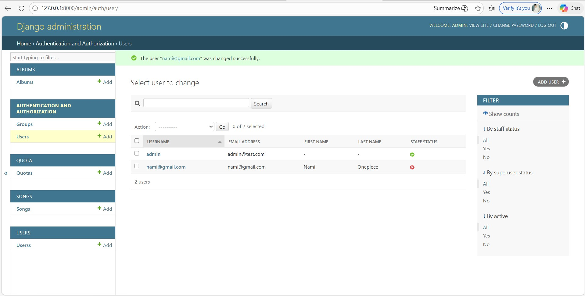
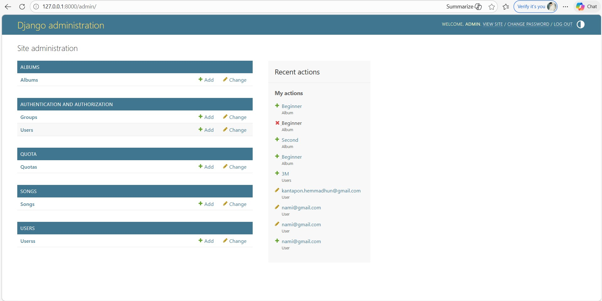
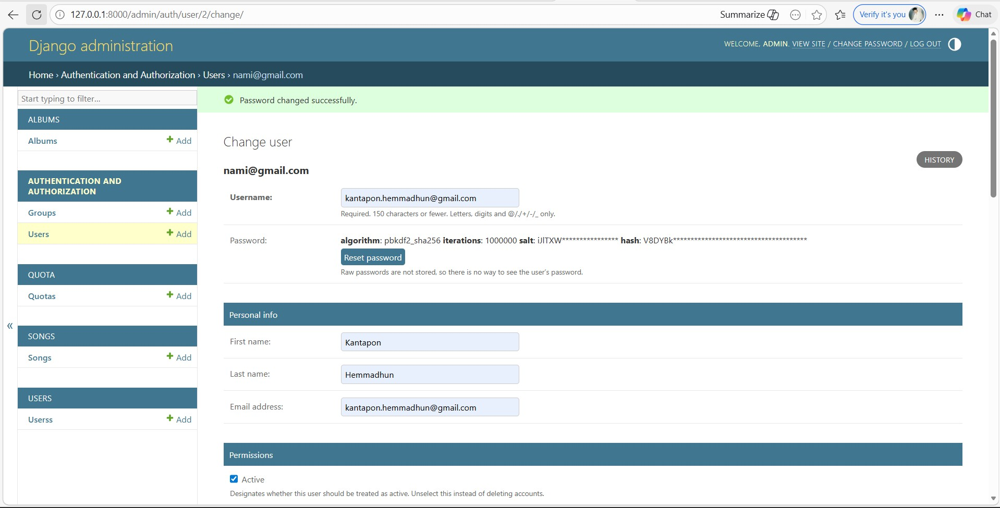
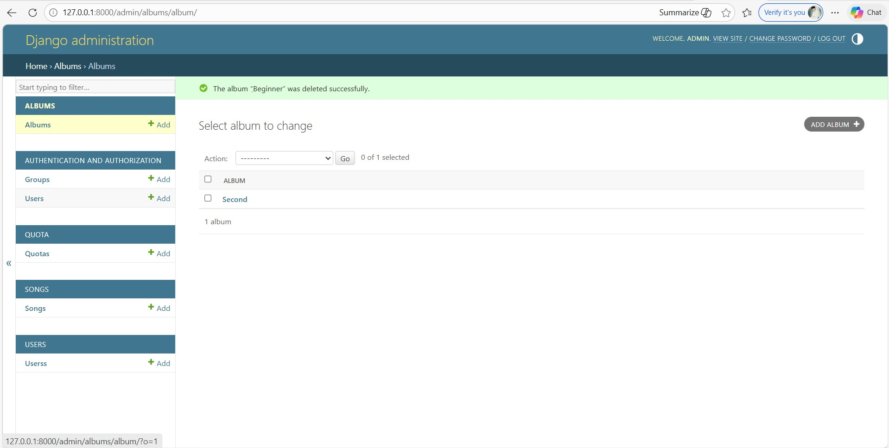

# Chithara

This project demonstrates **Create, Read, Update, and Delete (CRUD)** operations for core domain entities implemented using Django ORM.

## Implementation Approach

CRUD operations are implemented using the **Django Admin interface**, which allows direct interaction with persisted data in the database.

---

## Entities Covered

The following domain entities support full CRUD functionality:

* Users
* Quota
* Album
* Song

## CRUD Functionality

* **Create**: New records can be added through the Django Admin panel.
* **Read**: Existing records can be viewed in list and detail views.
* **Update**: Records can be modified using the edit functionality.
* **Delete**: Records can be removed from the database.

## Install and Run

1. Clone the project and move into the backend folder.

   ```bash
   git clone https://github.com/Kantapon2547/Chithara.git
   cd chithara
   ```
   
2. Install dependencies.
   ```bash
   pip install -r requirements.txt
   ```

3. Apply database migrations:
   ```bash
   python manage.py migrate
   ```

4. Run the Django development server:
   ```bash
   python manage.py runserver
   ```
   
5. Create a superuser account (for admin access):
   ```bash
   python manage.py createsuperuser
   ```

6. Open the Django Admin interface in your browser:
   ```bash
   http://127.0.0.1:8000/admin
   ```

7. Log in using the superuser credentials and perform CRUD operations on the available models.

---

## CRUD Operations

Screenshots of CRUD operations are included to demonstrate:

* Creating new users



* Viewing records



* Updating records



* Deleting records


